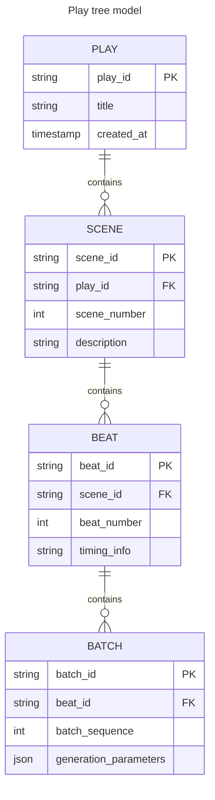

# ComfyUI_Play_Traversal

Provides a structured model and helper nodes for producing long video sequences on ComfyUI using low vram machines.

## Context

I have started playing with ComfyUI and the video gen space a few months ago. The first obstacle that is still the main on-going challenge is to be able to move out of the gimmick and proof-of-concept, and into a useful activity, on a low VRAM machine.

The iterations culminate with the dream setup I am aiming for: a full Play, fueled with all possible conditioning that's currently available. 

### Requirements

* Provide a structured narrative tree model, sharing conditionings with sub-tree nodes;

* Produce a decent quality long video (longer than 3s) that follows the narrative [1];

* Allow transmission of *what's needed to ensure continuity between video chunks* (probably Noisy Latent Composition [2] and the research concept of "adjacent latent transition mechanisms" [3]).

### Constraints

* Each part of the process must fit on GPU (8g VRAM)

### Standing on the shoulders of giants

This work was not started from scratch, it was inspired by, based on, and, in some cases, contains copies of bits and pieces from those awesome and others:

* (ComfyUI)[https://www.comfy.org/]: A highly customisable AI video gen platform providing the users with tools to solve their own problems, using a visual graph construction and execution mecanism; 

* (comfyui-easy-use)[https://github.com/yolain/ComfyUI-Easy-Use]: Providing quite a few helpful tools/ nodes to make easier the use of ComfyUI;

* (comfyui_essentials)[https://github.com/cubiq/ComfyUI_essentials]: Backfilling some of the bare necessities in ComfyUI:

* (RES4LYF)[https://github.com/ClownsharkBatwing/RES4LYF]: Pushing the boundaries of AI video gen with superior quality sampling and many other tools.

# Iterations plan

## Iteration 1: Scene construction (the input model)

The first step is to define the data model that will drive the video sequence generation loop. I drew inspiration from the theatre play composition:

* the **Play** is the full length of the production; it holds the parameters that are common to the full project; it is made of:

* **Scene**s, there is transition between scenes -- a change in locations, the introduction of a new character...

* Scenes are sequences of **Beat**s, which is a general emotional and energetic state of the scene, the remainder of the layout beeing similar, the background music may be different as well. A scene has a length in seconds.

* In order to fit the processing power of the underlying machine, a scene beat is broken down into a sequence of **Batch**es, each batch covering a part of the beat.

## Helper nodes

* **Play (Start)** paired with **Play (Continue)**: Looping over the batches, and serving the parameters and streams to the body of the loop.

## Examples

* workflows/dev_play_loop_minimal.json

## Links to references

* [1] [How to Generate Decent AI Video Without Breaking Your Piggy Bank](https://www.linkedin.com/pulse/how-generate-decent-ai-video-without-breaking-your-piggy-gedeon-lixef)

* [2] [Noisy Latent Composition](https://comfyui-wiki.com/en/workflows/noisy-latent-composition)

* [3] [VideoGen-of-Thought: Step-by-step generating multi-shot video with minimal manual intervention](https://arxiv.org/html/2412.02259v2)
