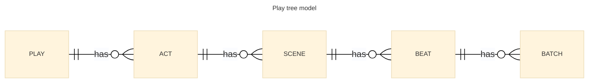
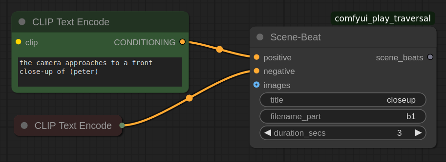
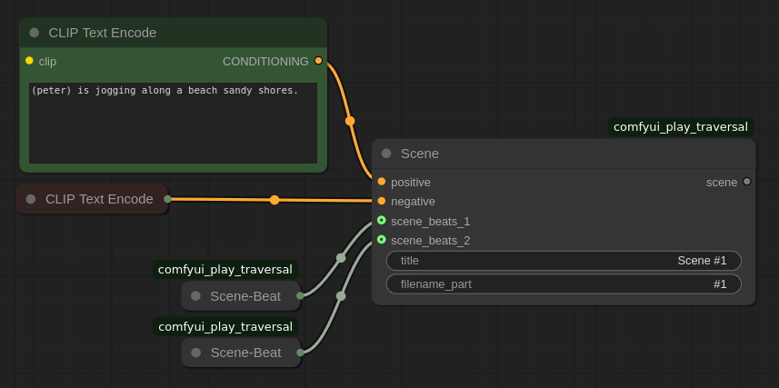
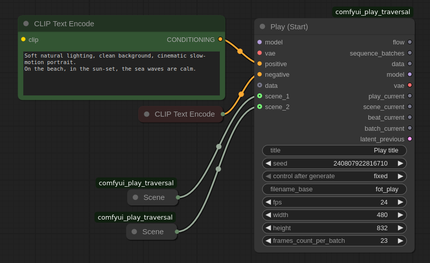
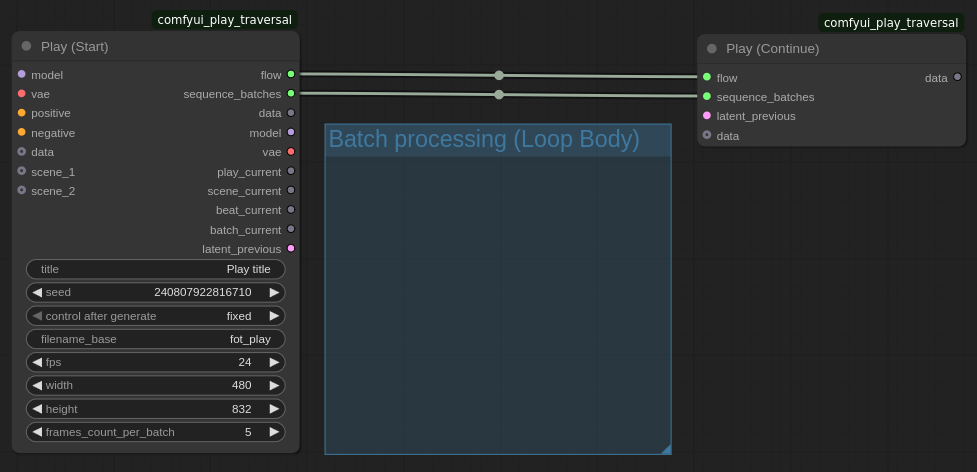
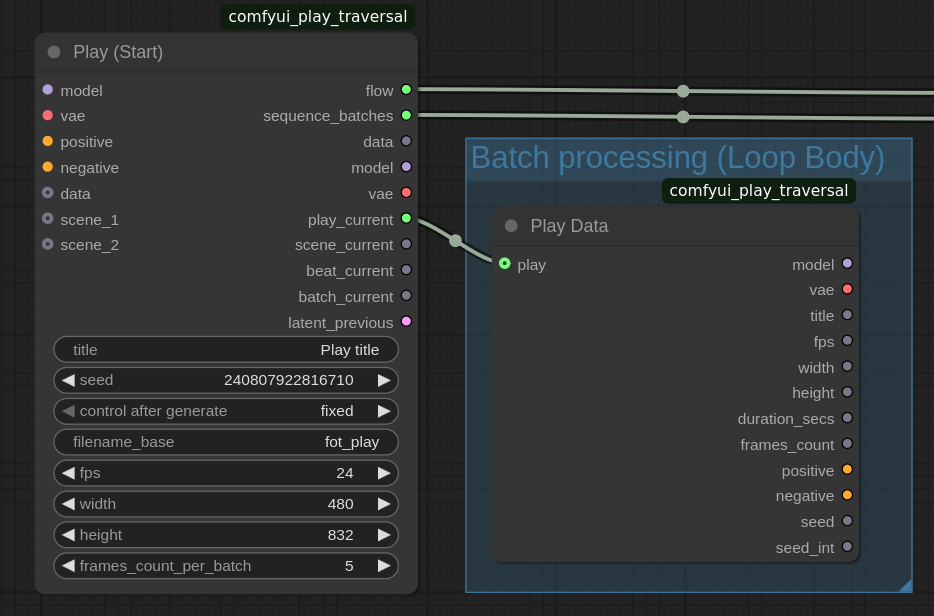
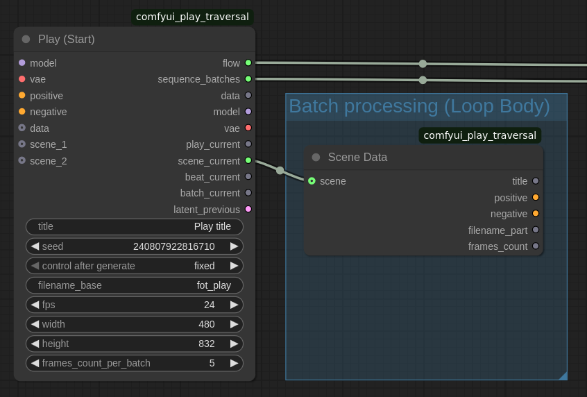
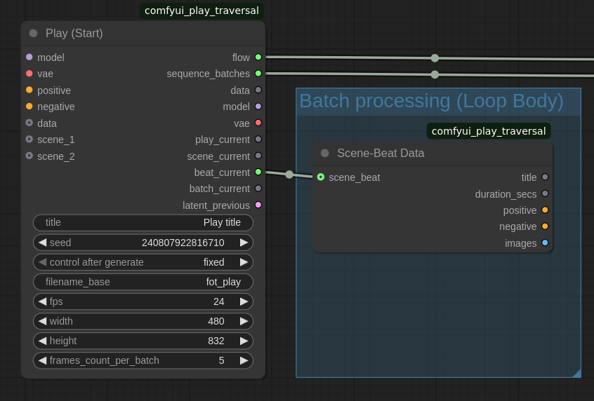
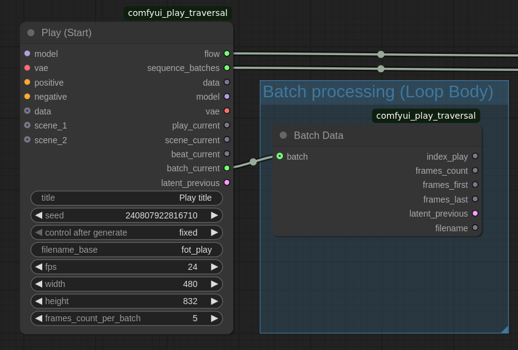

# ComfyUI_Play_Traversal

Provides a structured model and helper nodes for running a sampler loop over frame batches.

## Context

I have started playing with ComfyUI and the video gen space a few months ago. The first obstacle that is still the main on-going challenge is to be able to move out of the gimmick and proof-of-concept, and into a useful activity, on a low VRAM machine.

The first step is the construction of a narrative and looping over it. 

### Requirements

* Provide a structured narrative tree model, sharing conditionings with sub-tree nodes;

* Produce a decent quality long video (longer than 3s) that follows the narrative;

* Allow transmission of *what's needed to ensure continuity between video chunks* (probably Noisy Latent Composition and the research concept of "adjacent latent transition mechanisms").

### Constraints

* Each part of the process must fit on one GPU (8g VRAM) and 32g RAM.

### Standing on the shoulders of giants

This work was not started from scratch, it was inspired by, based on, and, in some cases, contains copies of bits and pieces from those awesome and others:

* The many contributors to platforms such as: [Hugging Face](https://huggingface.co/), and [CivitAI](https://civitai.com/).

* [ComfyUI](https://www.comfy.org/): A highly customisable AI video gen platform providing the users with tools to solve their own problems, using a visual graph construction and execution mecanism; 

* [comfyui-easy-use](https://github.com/yolain/ComfyUI-Easy-Use): Providing quite a few helpful tools/ nodes to make easier the use of ComfyUI;

* [comfyui_essentials](https://github.com/cubiq/ComfyUI_essentials): Backfilling some of the bare necessities in ComfyUI:

## Example workflow

The following sample workflows are included:

* [Empty Body](./workflows/dev_play_loop_empty.json)

## Scene construction (the input model)

### Design

The first step is to define the data model that will drive the video sequence generation loop. I drew inspiration from the theatre play composition:



* the **Play** is the full length of the production; it holds the parameters that are common to the full project; it is made of:

* **Act**s, which correspond to the chapters, or arcs.

* Acts are made up of a sequence of **Scene**s. There is typically transition between scenes -- a change in locations, the entrance or exit of a character, etc. that would result in crossfade, cut, fade_to_black, etc.

* Scenes are sequences of **Beat**s, which is a general emotional/ mood/ energetic segments of the scene, with consistent visual and audio characteristics, the remainder of the layout beeing similar (consistent visual and audio characteristics). The background music may be different as well (Tension, Anxiety, Mystery, Intrigue, Joy, Triumph, ...) A beat has a length in seconds (this is the only parameter that impacts the video total time).

* In order to fit the processing power of the underlying machine, a scene beat is broken down into a sequence of **Batch**es (batches are technical processing units constrained by hardware limitations), each batch covering a part of the beat, and tailored to the memory limitations (number of frames in the video chunk, number of steps in the sampling).

### Implementation

```TODO: update diagrams, add Act```

#### Node `Scene-Beat`

The Scene-Beat is the lowest level `Play` data construction:



> **_TODO:_**  Make optional the negative conditioning input.

#### Node `Scene` 



> **_TODO:_**  Make scene_beats_* a dynamic list input (currently hard-coded limit).

#### Node `Play (Start)`



> **_TODO:_**
> * Make scene_* a dynamic list input (currently hard-coded limit).
> * Find a way to make hidden: `sequence_batches`
-----

## Batch sequencing (the loop)

### Design

The main idea is to create a sub-graph (the loop body) that takes care of rendering a batch sequence, one batch at a time. All required data must be present as input to the loop body.

The loop starts with `Play (Start)`, and provides outputs to the loop body:

passed through from the inputs:

* the `model`,

* the `vae`, 

in addition to the Play data construction inputs.

### Implementation

#### Node `Play (Continue)`

Paired with `Play (Start)` using a flow link, the **`Play (Continue)`** marks the end of the loop.
The pair ensures looping over the batches, and serving the parameters and streams to the body of the loop.



The current play data, scene data, beat data, and batch data are available through the following data expansion nodes:

#### Node `Play Data`




#### Node `Scene Data`




#### Node `Scene-Beat Data`




#### Node `Batch Data`




